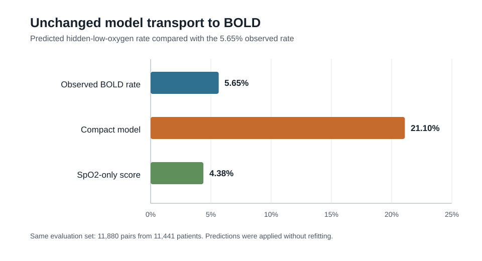

# Results at a glance

OpenOx V1 asked four connected questions: how pulse-oximeter error varied across devices, how often apparently reassuring readings hid low arterial oxygen, whether error differed with directly measured skin pigmentation or measurement context, and whether a compact risk model transferred to another cohort. The study is complete and frozen.

All values below are reviewed aggregate results already preserved in the final decision record. No participant-level results or newly derived restricted-data outputs are published here.

## Bottom line

- Error varied by device code and became larger at lower arterial oxygen levels.
- Hidden low oxygen occurred in 4.3% of the study's eligible reading pairs, but this controlled laboratory cohort should not be used to estimate clinical prevalence.
- Some device-specific results were consistent with greater overestimation at darker measured skin pigmentation and at lower perfusion, but support and measurement coverage varied.
- The richer compact risk model performed better internally, then failed when applied unchanged to BOLD. A simpler SpO2-only score transferred better, although imperfectly.

These findings describe research evidence, not clinical validation or regulatory performance.

## 1. Device accuracy

The primary accuracy analysis included 27,891 paired readings from 123 participants with arterial oxygen saturation from 70% through 100%. Across all eligible readings, average SpO2 was 1.130 percentage points higher than SaO2, and overall root-mean-square error (A_RMS) was 3.237 points.

| Arterial oxygen range | Paired readings | Participants | A_RMS | Plain-language reading |
|---|---:|---:|---:|---|
| 70% to under 80% | 8,039 | 120 | 4.192 | Error was largest in the lowest range. |
| 80% to under 90% | 9,033 | 123 | 3.230 | Error remained substantial. |
| 90% to 100% | 10,819 | 123 | 2.291 | Error was smaller at higher saturation. |

Eleven device/probe groups had enough support for the main device-level analysis. Ten had A_RMS estimates from 1.365 to 2.798. One opaque device-code group was a clear outlier at 4.671, driven partly by wider error at lower saturation. Average error was positive in all 11 groups, meaning SpO2 tended to read higher than SaO2. Because the public source uses opaque device codes, these results cannot be translated into manufacturer claims.

## 2. Hidden low oxygen

The main hidden-low-oxygen definition was SaO2 below 88% when the paired SpO2 was 92% to 96%. There were 261 such events among 6,062 eligible pairs from 123 participants: a pair-level rate of 4.31%. Those events came from 38 participants.

This result shows that apparently reassuring pulse-oximeter readings sometimes coexisted with low arterial oxygen in the controlled-desaturation data. It is not a clinical prevalence estimate because the cohort design, repeated readings, and experimental oxygen ranges do not represent routine patient care.

## 3. Measured skin pigmentation

The study used direct skin-color measurements rather than substituting race or ethnicity. The device-level evidence was mixed: some supported groups showed larger positive error at darker measured pigmentation, while other groups lacked enough coverage for a complete conclusion. These are device-specific associations, not a single universal skin-pigmentation effect.

ENCoDE provided a separate feasibility and replication check:

- The released tables reconstructed 615 eligible pairs from 127 patients, compared with 521 pairs from 128 patients in the publication's earlier extract. No post hoc 521-row subset was selected.
- Only three pairs were in the lower arterial-oxygen range, so that part of the planned pigmentation analysis could not be tested.
- In the higher range, adjusted SpO2 overestimation rose from 1.231 points in Monk Skin Tone 1-4 to 1.991 points in Monk Skin Tone 8-10. The largest contrast was 0.760 points, with an upper uncertainty bound of 1.527 against the study's 1.5-point comparison margin.

The direction was consistent with greater overestimation at darker measured pigmentation, but the result narrowly missed the prespecified uncertainty requirement and is therefore inconclusive.

## 4. Perfusion and measurement context

Perfusion-index values were analyzed only within device groups because their scales were not comparable across devices. For two well-supported device-code groups, each doubling of the device's perfusion index was associated with about 0.7 to 0.8 percentage points less positive SpO2 error in both arterial-oxygen ranges. In simpler terms, lower perfusion was associated with greater overestimation in those groups. Two other supported groups did not show a clear average linear relationship.

Warming and finger diameter did not show clear adjusted associations. Total hemoglobin and exploratory heart rate did show associations, while pH, carbon dioxide, carboxyhemoglobin, methemoglobin, age, respiratory rate, and P50 did not have uncertainty intervals excluding no difference in their respective models.

These are adjusted measurement-context associations. They do not prove causation, establish a universal perfusion cutoff, or apply to devices that do not report a comparable perfusion measure.

## 5. Risk-model transport

| Evaluation | Population | Brier | Log loss | PR-AUC | ROC-AUC | Interpretation |
|---|---:|---:|---:|---:|---:|---|
| OpenOx compact model, median internal repeat | OpenOx, SpO2 92-96% | 0.03868 | 0.15171 | 0.17411 | 0.80104 | Better than the internal SpO2-only comparator, with calibration caution. |
| OpenOx SpO2-only comparator, median internal repeat | OpenOx, SpO2 92-96% | 0.03953 | 0.16112 | 0.10547 | 0.73302 | Required simple comparator. |
| Frozen compact model, unchanged BOLD transfer | 11,880 pairs from 11,441 patients | - | - | 0.0735 | 0.5680 | Failed unchanged transport; predicted 21.10% risk versus 5.65% observed. |
| Frozen SpO2-only score, unchanged BOLD diagnostic | Same BOLD denominator | 0.05226 | 0.21301 | 0.0998 | 0.6608 | Better than the compact model but still imperfect and exploratory. |
| BOLD-updated SpO2-only logistic recalibrator | 20 x 5-fold patient-level cross-validation | 0.05208 | 0.20762 | - | - | Selected bounded update; requires testing in a third untouched cohort. |

The richer compact model substantially overpredicted risk in BOLD. The simpler score was closer to the observed event rate and ranked outcomes better, but it was not a complete solution. Updating that score with BOLD outcomes improved probability accuracy; because those same outcomes informed the update, this is model-updating evidence rather than independent external validation.

ENCoDE's eligible risk-model denominator contained 157 pairs from 71 patients and no hidden-low-oxygen events, so the risk model was not scored there.

## Claim boundaries

The completed evidence supports claims about internal performance, failed unchanged transport, partial replication, and a stopped feasibility study. It does not support claims of clinical validation, clinical utility, deployment readiness, universal device or pigmentation effects, or successful independent validation of the BOLD-updated score.

For the governing evidence hierarchy, see [`FINAL_STATUS.md`](FINAL_STATUS.md). For full methods, uncertainty estimates, and decisions D001-D036, see [`PROJECT_HUB.md`](PROJECT_HUB.md). For data-access and public-release limits, see [`DATA_USE.md`](../DATA_USE.md).
