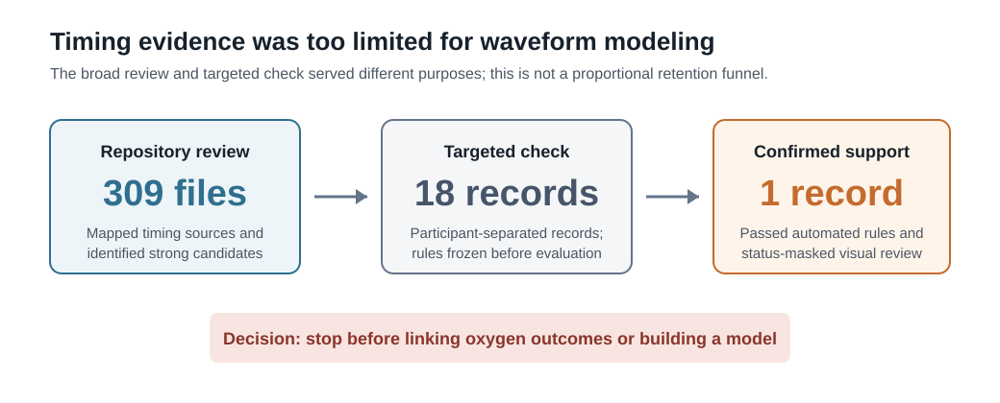

# Waveform Study: What Was Tested and Why It Stopped

> **Status:** Closed after the timing review. No waveform-based error model was developed.

## Why the study was considered

The completed OpenOx project examined when pulse-oximeter readings may differ from reference arterial oxygen measurements. A follow-up study asked whether the strength, shape, or stability of raw pulse signals could provide useful context about those differences.

Before testing that idea, each waveform section had to be matched reliably to the correct commercial-device SpO2 reading and reference SaO2 measurement.

## Why timing was a separate problem

V1 used sample markers from a lower-frequency reference recording to pair blood-gas results with pulse-oximeter readings. The follow-up study used raw red and infrared pulse signals from a separate investigational recorder, not the commercial oximeters' internal signals.

The two systems did not share enough documented timing information to assume that a time shown in one source referred to the same moment in the other. The successful V1 pairing method therefore could not simply be reused.

## What was tested

The timing work stayed sealed from oxygen outcomes: saturation, blood-gas, pigmentation, perfusion, error, and device-performance fields were not used to develop or judge the matching method.

The automated check compared pulse landmarks from the investigational signal with ECG landmarks from the reference recording. A record needed all of the following:

- plausible pulse and ECG rates;
- at least 50 matched beats and at least 80% matching support;
- typical beat-to-beat timing disagreement no greater than 80 milliseconds;
- no more than 100 milliseconds of timing change between the early and late parts of the record;
- a clear preferred match rather than a similarly plausible repeating alternative;
- a separate visual review that was completed without showing the automated pass/fail result.

These rules tested whether one recording could be aligned to another consistently. They did not test a relationship with oxygen-measurement error.

## Selection and result

The broader review covered timing information across 309 waveform files. It was used to understand the available recording types and find the strongest candidates; it was not a 309-to-18 participant-retention funnel.

The final targeted check contained 18 records: six from each of three recording layouts. Their participants were separate from the earlier method-development and holdout work. The matching rules and thresholds were frozen before this check.

Only one of the 18 records passed both the automated rules and the status-masked visual review. Seven additional records looked visually interpretable but failed the quantitative rules, so they were not promoted as reliable matches.

| Review layer | Result | Decision |
|---|---:|---|
| Repository timing review | 309 files | Documentation was insufficient to establish a dependable shared clock. |
| Targeted participant-separated check | 18 records | Frozen timing rules were tested without oxygen outcomes. |
| Automated plus masked visual support | 1 record | Too little support for oxygen-outcome linkage or waveform modeling. |

## Why the study stopped

A waveform section assigned to the wrong oxygen measurement could create a convincing but false relationship. One confirmed record was not enough to show that the matching method worked across the repository.

Further threshold adjustment might have increased the number of apparent matches, but it would not have supplied the missing timing documentation. The project therefore stopped before calculating waveform characteristics, linking waveforms to oxygen errors, or fitting a model.

## What the result does and does not mean

The result means that raw pulse recordings were available and a reproducible timing check was attempted, but the available records could not support reliable matching at useful scale. Stopping protected the study from conclusions based on uncertain links.

It does not mean that waveform methods are ineffective, that the recordings were the commercial devices' internal signals, or that a waveform model was built and performed poorly. This was a stopped study, not a negative model result.

## What a future study would need

A future study should record the pulse waveforms, evaluated-device readings, and reference blood-sample markers on synchronized systems from the beginning. Timing rules should be set before looking at measurement errors, and model development should remain separate from an untouched validation group. That would create evidence the available retrospective records could not provide.

This would be a new study under a new protocol, not retrospective tuning of frozen OpenOx V1.

## Public-release boundary

This page contains only the rationale, aggregate counts, prespecified matching thresholds, and final decision. It does not publish PhysioNet waveforms, headers, filenames, timestamps, participant-level matches, derived patient-level data, restricted figures, or restricted tables.

Access to the underlying resources remains governed by the PhysioNet requirements in [`DATA_USE.md`](../DATA_USE.md).
