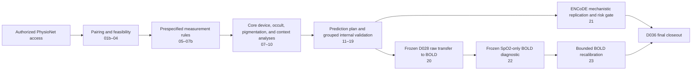
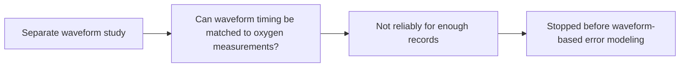

# Workflow map

This page is the shortest route from a research question to the relevant evidence and code. Notebook prefixes preserve the frozen analysis chronology; do not treat the sequence as permission to retune a completed model.



The later waveform study is separate from that evidence chain:



## Find the right entry point

| If you want to… | Read first | Notebook stage | Supporting code |
|---|---|---|---|
| Understand the final scientific conclusion | [`RESULTS.md`](RESULTS.md), then [`FINAL_STATUS.md`](FINAL_STATUS.md) | `19`–`23` | `scripts/analysis/`, selected `scripts/qa/` |
| Understand cohort construction and pairing | Decisions D002–D007 in [`PROJECT_HUB.md`](PROJECT_HUB.md) | `01b`–`04` | `scripts/analysis/window_sensitivity.py` and matching builders |
| Review device performance | Roadmap analytic core | `07`, `07b`, `07c` | matching builders in `scripts/build/` |
| Review occult-hypoxemia analysis | [`GLOSSARY.md`](GLOSSARY.md), roadmap analytic core | `08` | matching builder in `scripts/build/` |
| Review measured-pigmentation evidence | Decisions D011, D016, D032–D033 | `05`, `09`, `21` | `scripts/analysis/pigmentation_support.py`, `encode_external_validation.py` |
| Review perfusion and physiologic context | Decisions D012, D017 | `06`, `10`, `18` | matching analysis/build scripts |
| Audit internal model development | Decisions D018–D028 | `11`–`19` | model builders and selected QA scripts |
| Audit unchanged external transfer | Decisions D030–D031 | `20` | `scripts/analysis/bold_external_validation.py` |
| Audit the simpler BOLD diagnostic | Decision D034 | `22` | `scripts/analysis/bold_spo2_baseline_validation.py` |
| Audit model updating | Decision D035 | `23` | `scripts/analysis/bold_recalibration_validation.py` |
| Understand why the waveform study stopped | [`WAVEFORM_STUDY.md`](WAVEFORM_STUDY.md) | Not part of the public V1 notebook sequence | No public waveform analysis code |
| Rebuild notebook source | [`REPRODUCIBILITY.md`](REPRODUCIBILITY.md) | Any public notebook | `python -m scripts.build.<builder_name>` |
| Check public-release safety | [`DATA_USE.md`](../DATA_USE.md) | Not applicable | `python scripts/release_check.py` |

## Directory responsibilities

```text
notebooks/          output-cleared chronological research record
scripts/analysis/   substantive calculations against authorized local data
scripts/build/      deterministic notebook-source constructors
scripts/qa/         separate scripted consistency checks for selected stages
src/                shared configuration and canonical repository paths
docs/               conclusions, navigation, governance, and reproduction guidance
```

The public repository does not contain the inputs or generated restricted artifacts needed to reproduce numerical outputs. An authorized user can inspect the full code path and rerun it locally under the frozen rules described in [`REPRODUCIBILITY.md`](REPRODUCIBILITY.md).
